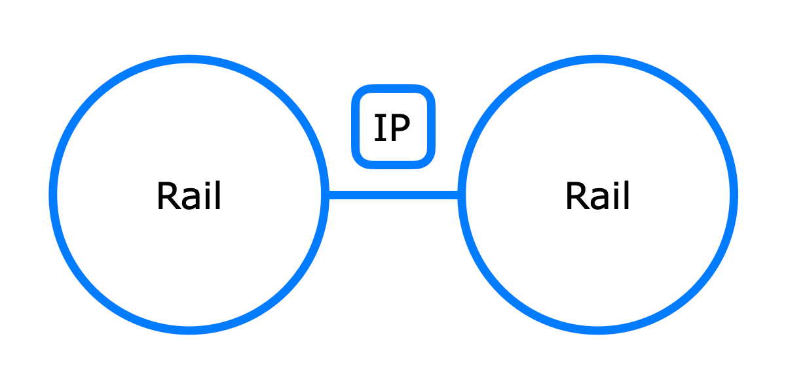

<p align="center">
  <a href="https://github.com/darkwood-fr/railway-fbp">
    
  </a>
</p>

## Why ?

Railway Flow Based Programming concept aims to solve

- Adopt asynchronous as native implementation
- Build your code with functional programming
- Assemble your code visually

## Installation

PHP 8.0 is the minimal version to use _Railway Flow Based Programming_ is 8.0  
The recommended way to install it through [Composer](http://getcomposer.org/) and execute

```bash
composer require darkwood/railway-fbp
```

## Usage

A working script is available in the bundled `examples` directory

- in `packages/php`  
  Run Rail : `php examples/rail.php`
- in `packages/symfony`  
  Start Server : `php examples/server.php`  
  Start Client(s) : `php examples/client.php`

Messaging part require to install [Docker](https://www.docker.com) and execute `docker-compose up -d`

## Documentation

[https://darkwood-fr.github.io/railway-fbp](https://darkwood-fr.github.io/railway-fbp)

## License

_Railway Flow Based Programming_ is released under the AGPL-3.0 License.
