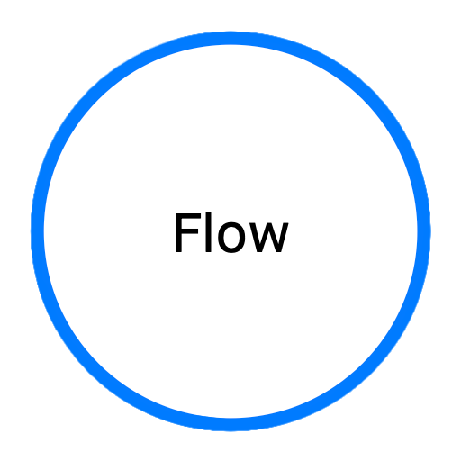

<p align="center">
  <a href="https://github.com/darkwood-com/flow">
    
  </a>
</p>

## Why ?

Flow concept aims to solve

- Adopt asynchronous as native implementation
- Build your code with functional programming
- Assemble your code visually

## Installation

PHP 8.3 is the minimal version to use Flow
The recommended way to install it through [Composer](http://getcomposer.org) and execute

```bash
composer require darkwood/flow
```

## Usage

```php
<?php

use Flow\Flow\Flow;
use Flow\Ip;

class D1 {
    public function __construct(public int $n1) {}
}

class D2 {
    public function __construct(public int $n2) {}
}

class D3 {
    public function __construct(public int $n3) {}
}

class D4 {
    public function __construct(public int $n4) {}
}

$flow = Flow::do(static function() {
    yield fn (D1 $data1) => new D2($data1->n1 += 1);
    yield fn (D2 $data2) => new D3($data2->n2 * 2);
    yield function(D3 $data3) {
        printf("my number %d\n", $ip->data->n3)); // display 'my number 10'

        return new D4($data3->n3);
    };
});

$ip = new Ip(new D1(4));
$flow($ip);
```

## Examples

A working script is available in the bundled `examples` directory

- Run Flow : `php examples/flow.php`
- Run Y-Combinator Flow : `php examples/yflow.php`
- Start Server : `php examples/server.php`
  Start Client(s) : `php examples/client.php`

## Documentation

[https://darkwood-com.github.io/flow](https://darkwood-com.github.io/flow)

## License

Flow is released under the MIT License.
